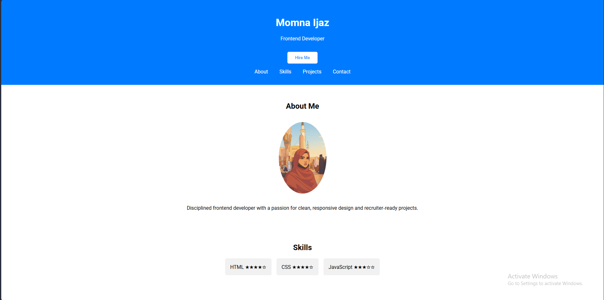
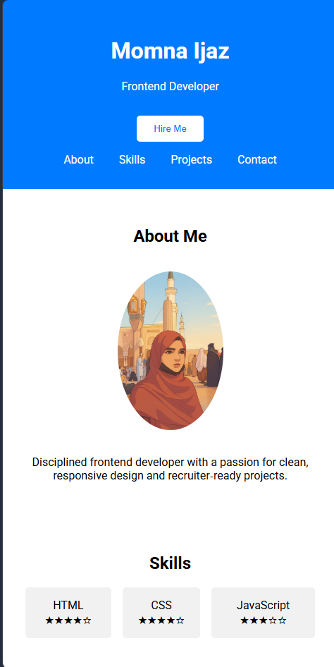

# Personal Portfolio Website - Momna Ijaz

## Overview

A professional portfolio website showcasing skills, projects, and contact information. Designed to be recruiter-ready and minimal.

## Features

- Hero section with name, tagline, and Hire Me button
- About Me section with profile photo and bio
- Skills section with ratings
- Projects section linking to demos
- Contact section with email and LinkedIn
- Smooth scroll navigation (JavaScript)
- Hover effects for interactive polish

## Tech Stack

- HTML5
- CSS3 (Flexbox, transitions)
- JavaScript (smooth scroll)

## Deployment

- Live Demo: [\[Demo Link Here\]](https://portfolio-site-nine-lovat.vercel.app/)
- GitHub Repo: [\[Repo Link Here\]](https://github.com/Momna533/portfolio-site)

## Screenshots

## Author

Momna Ijaz – Frontend Developer
